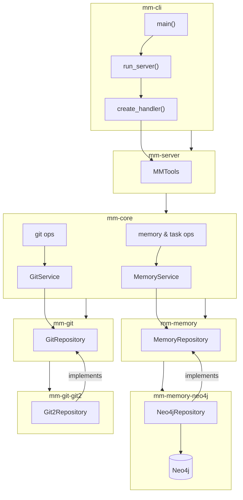

# Middle Manager

Middle Manager is a Model Context Protocol (MCP) server for a Neo4j memory graph. It uses a hexagonal architecture to keep domain logic independent of external protocols.  
In addition to storing knowledge, Middle Manager manages project tasks and integrates basic Git repository information.

### Memory

#### Resources

| URI | Description | Example |
| --- | ----------- | ------- |
| `memory://{name}` | Read a memory entity by name | `memory://tech:language:rust` |

The `memory://` scheme is dynamic: any entity name can be requested. The server exposes this through a single template from `list_resource_templates`.

#### Tools

| Name | Purpose |
| ---- | ------- |
| `create_entities` | Create one or more entities |
| `create_relationships` | Create relationships between entities |
| `delete_entities` | Delete entities from the graph |
| `delete_relationships` | Delete relationships between entities |
| `find_entities_by_labels` | Find entities with specific labels |
| `find_relationships` | Find relationships between entities |
| `find_related_entities` | Find entities related to another entity (supports `depth` parameter) |
| `create_tasks` | Create task entities |
| `get_task` | Retrieve a task by name |
| `update_task` | Update a task |
| `delete_task` | Delete a task |
| `get_entity` | Retrieve an entity by name |
| `get_git_status` | Get Git status for a repository path |
| `get_graph_meta` | List entities related to the memory graph root |
| `get_project_context` | Retrieve context for a project |
| `list_projects` | List known projects |
| `update_entity` | Update an entity |
| `update_relationship` | Update a relationship |

The `find_related_entities` tool accepts a `depth` parameter controlling how many
relationship hops to follow. Depth values must be between 1 and 5.

The `get_graph_meta` tool returns entities outbound from the `tech:tool:memory_graph` node.
It traverses the graph with a fixed depth of `5` and accepts an optional `relationship` filter.

## Project Structure

The project is organized as a Rust workspace with the following crates:

- **mm-cli**: Command-line interface for running the MCP server
- **mm-core**: Core domain operations that depend on the `MemoryService` from `mm-memory`
- **mm-memory**: Memory domain types including the `MemoryService` struct and `MemoryRepository` trait
- **mm-memory-neo4j**: Neo4j-backed memory repository implementation
- **mm-git**: Git service and repository traits
- **mm-git-git2**: `git2`-based Git repository implementation
- **mm-server**: MCP server implementation
- **mm-utils**: Shared utility helpers

All workspace crates reside in the `crates/` directory to keep the repository root tidy.

### Code Structure Diagram



## Features

### Memory

- Stores and retrieves data in Neo4j
- Create and retrieve entities with labels, observations, and properties
- Set, add, remove, or clear observations
- Create relationships between entities

- Manage project tasks and their dependencies
- Retrieve project context and list projects

- Fetch any entity with `memory://{name}`; `list_resource_templates` advertises this
- Configurable logging

### Git

- Query repository status with `get_git_status`

## Building

Run `cargo build` to compile all crates.

The workspace uses Rust 2024 as pinned in [`rust-toolchain.toml`](./rust-toolchain.toml).

### Using Nix

With [Nix](https://nixos.org/), you can build the CLI package:

```bash
nix build .#middle_manager
```

Install Nix with the [Determinate Systems installer](https://install.determinate.systems/nix):

```bash
curl -L https://install.determinate.systems/nix | sh -s -- --no-confirm
```

## Running

Run `cargo run -p mm-cli -- --config config/default.toml,config/local.toml` to start the CLI.
Use the `tools` subcommand to interact with MCP tools.

### CLI Options

```
USAGE:
    mm-cli [OPTIONS] [COMMAND]

OPTIONS:
    -l, --log-level <LOG_LEVEL>    Log level [default: info] [possible values: error, warn, info, debug, trace]
    -f, --logfile <FILE>           Path to log file (required if log level is specified)
    -r, --rotate-logs              Rotate logs (clear log file if it exists) [default: true]
    -c, --config <FILE>            Paths to config files (comma-separated, required)
    -h, --help                     Print help
    -V, --version                  Print version

COMMANDS:
    server    Start the MCP server (default)
    tools     Call server tools from the CLI
```

### Configuration

Configuration is loaded from the files specified with `-c` or `--config`.
Multiple paths can be provided separated by commas, allowing layered
configuration (for example `-c config/default.toml,config/local.toml`).

Example configuration:

```toml
[neo4j]
uri = "neo4j://localhost:7687"
username = "neo4j"
password = "password"
```

With `docker-compose.yml`, Neo4j runs on port `7688`. Update `config/local.toml` or set `MM_NEO4J__URI` to `neo4j://localhost:7688`.

### Using Tools

List available tools:

```bash
cargo run -p mm-cli -- tools list --config config/default.toml,config/local.toml --log-level debug
```

Call a tool (example adds an observation):

```bash
cargo run -p mm-cli -- tools call add_observations '{"name":"example","observations":["demo"]}' --config config/default.toml,config/local.toml
```

Call the built-in `tools/list` operation:

```bash
cargo run -p mm-cli -- tools call tools/list '{}' --config config/default.toml,config/local.toml
```

View the JSON schema for a tool:

```bash
cargo run -p mm-cli -- tools schema MMTools add_observations --config config/default.toml,config/local.toml
```


## Development

### Using Just

Use the `justfile` for common tasks:

```bash
# List available commands
just

# Run the MCP inspector with mm-cli
just inspect

# Run with debug logging
just inspect-debug

# Clean Neo4j volumes
just clean-neo4j
```

### Using MCP Inspector

To test the MCP server with the inspector:

```bash
npx @modelcontextprotocol/inspector cargo run -p mm-cli
```

### Using Nix

This repository provides a Nix flake. Enter with `nix develop`, build with `nix build`, and run checks with `nix flake check`.

The flake builds the workspace with [naersk](https://github.com/nix-community/naersk) and the [rust overlay](https://github.com/oxalica/rust-overlay).

## Architecture

The project follows a hexagonal architecture (ports and adapters) pattern:

- **Core Domain**: Business logic independent of external protocols
- **Ports**: Interfaces for external dependencies
- **Adapters**: Implementations of ports for specific technologies
- **MCP Protocol**: External interface for AI assistants

This keeps the core domain isolated and testable.

## License

This project is licensed under the [Mozilla Public License 2.0](LICENSE).
