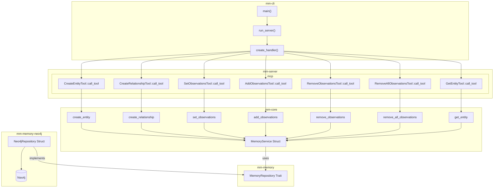

# Middle Manager

Middle Manager is a Model Context Protocol (MCP) server that provides tools for interacting with a Neo4j memory graph. It uses a hexagonal architecture to separate domain logic from external protocols.

### Memory

#### Resources

| URI | Description | Example |
| --- | ----------- | ------- |
| `memory://{name}` | Read a memory entity by name | `memory://tech:language:rust` |

#### Tools

| Name | Purpose |
| ---- | ------- |
| `create_entity` | Create one or more entities |
| `create_relationship` | Create relationships between entities |
| `get_entity` | Retrieve an entity by name |
| `set_observations` | Replace all observations for an entity |
| `add_observations` | Append observations to an entity |
| `remove_observations` | Remove specific observations from an entity |
| `remove_all_observations` | Delete all observations from an entity |

## Project Structure

The project is organized as a Rust workspace with the following crates:

- **mm-cli**: Command-line interface for running the MCP server
- **mm-core**: Core domain operations that depend on the `MemoryService` from `mm-memory`
- **mm-memory**: Memory domain types including the `MemoryService` struct and `MemoryRepository` trait
- **mm-memory-neo4j**: Neo4j-backed memory repository implementation
- **mm-server**: MCP server implementation
- **mm-utils**: Shared utility helpers

All workspace crates reside in the `crates/` directory to keep the repository root tidy.

### Code Structure Diagram



## Features

### Memory

- Stores and retrieves knowledge from a Neo4j graph database
- Entity management: create and retrieve entities with labels, observations, and properties
- Observation management: set, add, remove, or clear observations for an entity
- Relationship management: create relationships between entities

- **Configurable Logging**: Control log level and file output

## Building

Run `cargo build` from the repository root to compile all crates.

The workspace requires the **Rust 2024 edition**. CI pins the toolchain in
[`rust-toolchain.toml`](./rust-toolchain.toml), so ensure your local setup
matches that file.

### Using Nix

If you have [Nix](https://nixos.org/) installed you can build the CLI package with:

```bash
nix build .#middle_manager
```

The [Determinate Systems installer](https://install.determinate.systems/nix) provides a fast way to install Nix:

```bash
curl -L https://install.determinate.systems/nix | sh -s -- --no-confirm
```

## Running

Execute `cargo run -p mm-cli` to build and run the CLI with default settings.

### CLI Options

```
USAGE:
    mm-cli [OPTIONS]

OPTIONS:
    -l, --log-level <LOG_LEVEL>    Log level [default: info] [possible values: error, warn, info, debug, trace]
    -f, --logfile <FILE>           Path to log file (required if log level is specified)
    -r, --rotate-logs              Rotate logs (clear log file if it exists) [default: true]
    -c, --config <FILE>            Path to config file
    -h, --help                     Print help
    -V, --version                  Print version
```

### Configuration

The server looks for configuration files in the following order:
1. Custom config file specified with `-c` or `--config`
2. `config/default.toml`
3. `config/local.toml` (gitignored for local overrides)

Example configuration:

```toml
[neo4j]
uri = "neo4j://localhost:7687"
username = "neo4j"
password = "password"
```

When using the provided `docker-compose.yml` file, Neo4j is exposed on host
port `7688` rather than the default `7687`. Update `config/local.toml` or set
the environment variable `MM_NEO4J__URI` to `neo4j://localhost:7688` when
running with Docker.

## Development

### Using Just

The project includes a `justfile` with common development tasks:

```bash
# List available commands
just

# Run the MCP inspector with mm-cli
just inspect

# Run with debug logging
just inspect-debug

# Clean Neo4j volumes
just clean-neo4j
```

### Using MCP Inspector

To test the MCP server with the inspector:

```bash
npx @modelcontextprotocol/inspector cargo run -p mm-cli
```

### Using Nix

This repository provides a Nix flake. Enter the development environment with:

```bash
nix develop
```

Build the workspace via:

```bash
nix build
```

Run the flake's checks:

```bash
nix flake check
```

The flake uses [naersk](https://github.com/nix-community/naersk) together
with the [rust overlay](https://github.com/oxalica/rust-overlay) to build the
Rust workspace.

## Architecture

The project follows a hexagonal architecture (ports and adapters) pattern:

- **Core Domain**: Business logic independent of external protocols
- **Ports**: Interfaces for external dependencies
- **Adapters**: Implementations of ports for specific technologies
- **MCP Protocol**: External interface for AI assistants

This architecture ensures that the core domain logic is isolated from external concerns, making it more maintainable and testable.

## License

This project is licensed under the [Mozilla Public License 2.0](LICENSE).
